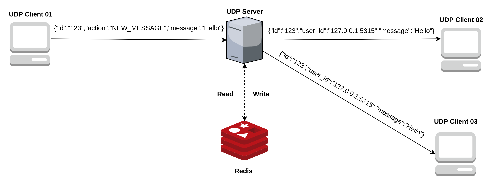

# *UDP CHAT*

# *Dependencies*
* Golang >= 1.16
* Redis

# *Architecture*

# *Main Rules*
* The client can only delete a message sent by him
* When one message is deleted it disappears for all client and is deleted in the repository. 
* The length of the history is configurable, now is set to **20**, but you can change in the **default.yaml**
* The user is defined by the client ip and port connected in server
* When all clients disconnect from the chat the DB is flushed

# *Technical Decisions*
* Uses the `container/list` to bring performance to the operations like delete a message from history in server
* Redis is not a strong dependency, if something bad happens to redis the chat would continue working.
* Don't use redis specific functions like Ltrim to maintain the history size so as not to create a coupling between the provider and the service.
# *How to Run The Application*
 ## Server:
  To run the server we have two ways:

 ### make run-server-with-redis:
 Use this command if you don't have one instance of redis. This command will run one docker-compose to up one instance of redis and run the application

 ### make run-server:
 Use this command if you have one instance of redis. To use your redis instance change the configuration in configs/development.yaml

## Client:
To run the client use this command **make run-client**

# *How to use the client*
After the client is running, he will accept the following commands:

* **/msg**
Use this command to send new messages for the server. Eg:
  ``/msg Hello``
  
* **/del** Use this command to delete messages previously sent by you. This command receives the id of the message generate when the message was sent. Eg:
``/del 123``
 
* **/quit** Use this command to leave the room

# *Libraries*
* [go-redis](https://github.com/go-redis/redis)
* [gostart](https://github.com/maiaaraujo5/gostart)
* [fx](https://github.com/uber-go/fx)
* [miniredis](https://github.com/alicebob/miniredis)
* [testify](https://github.com/stretchr/testify)
